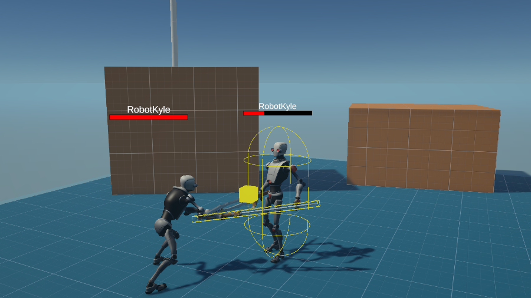
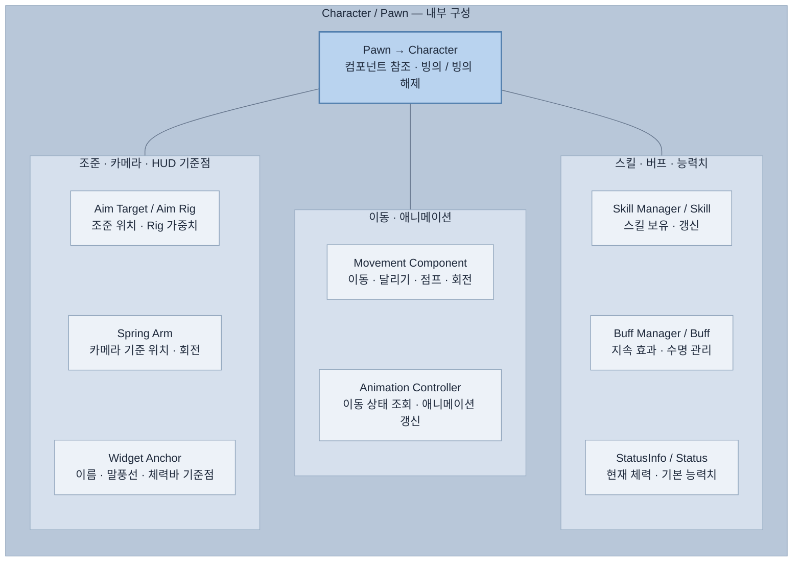

# Framework for Unity

**게임 개발에 필요한 기능을 직접 만들고 쌓아가는 개인용 Unity 프레임워크**

## 1. 프로젝트 문서

프로젝트 구조, 다이어그램, 개발된 기능과 작성 요령은 아래 다큐먼트에서 확인하실 수 있습니다.

[프로젝트 다큐먼트 보기](https://mdj0126.github.io/FrameworkForUnity/docs/documentation/index.html)

## 2. 소개

프로젝트를 시작할 때 반복해서 사용하는 기능과 구조를 정리하고,  
직접 구현하며 학습한 내용을 하나의 재사용 가능한 기반으로 만드는 프로젝트입니다.

개인 프로젝트의 기반으로 사용하는 동시에 **샘플 코드 제출 및 기술 검토 자료**로도 활용합니다.  
완성된 하나의 게임을 제공하는 저장소가 아니라, 기능별 구현과 설계 방식을 보여주는 데 목적이 있습니다.

기존 Unity 개발 경험을 통해 정립한 주요 패턴에 Unreal Engine의 장점을 접목해 개발하고 있습니다.

[프로젝트 다운로드 (ZIP)](https://github.com/MDJ0126/FrameworkForUnity/archive/refs/heads/main.zip)

**프로젝트 파일 용량: 약 400MB**

## 3. 프레임워크 구조

전체 연결과 캐릭터 내부 구성을 나누어 표시합니다. 전체 연결도에는 시스템 사이의 주요 연결만, 캐릭터 상세도에는 보유하거나 참조하는 구성 요소를 나열합니다.

### 전체 연결

```mermaid
---
config:
  theme: base
  themeVariables:
    background: "#b8c7d9"
    primaryColor: "#edf2f8"
    primaryTextColor: "#1e293b"
    primaryBorderColor: "#94a3b8"
    lineColor: "#64748b"
    secondaryColor: "#d6e0ed"
    tertiaryColor: "#d6e0ed"
    clusterBkg: "#d6e0ed"
    clusterBorder: "#8da2ba"
    titleColor: "#334155"
    edgeLabelBackground: "#d6e0ed"
  themeCSS: |
    a, a:link, a:visited, a:hover, a:active, a:focus, a *,
    .node a, .node a:link, .node a:visited, .node a:hover,
    .node .nodeLabel, .node .nodeLabel *, .node text {
      color: #1e293b !important;
      fill: #1e293b !important;
      text-decoration: none !important;
      text-decoration-line: none !important;
    }
---
flowchart LR
    GameMode[Game Mode] -->|기본 Pawn 빙의 요청| Controller[Player Controller]
    Controller -->|빙의 · 입력 전달| Character[Character / Pawn]
    Controller -->|Spring Arm 연결| Camera["Camera Controller<br/>궤도 회전 · 장애물 대응"]
    Character -->|HUD 부착 · 해제| HUD["HUD Manager<br/>Object Pool · 월드 추적 HUD"]

    classDef default fill:#edf2f8,stroke:#8da2ba,color:#1e293b
    classDef focus fill:#b9d3ef,stroke:#527fae,color:#1e293b,stroke-width:2px
    class Character focus

    click GameMode href "https://github.com/MDJ0126/FrameworkForUnity/blob/main/Assets/Scripts/Management/GameMode.cs" "GameMode.cs 열기" _blank
    click Controller href "https://github.com/MDJ0126/FrameworkForUnity/blob/main/Assets/Scripts/InGame/Object/PlayerController.cs" "PlayerController.cs 열기" _blank
    click Character href "https://github.com/MDJ0126/FrameworkForUnity/blob/main/Assets/Scripts/InGame/Object/Pawn/Character/Character.cs" "Character.cs 열기" _blank
    click Camera href "https://github.com/MDJ0126/FrameworkForUnity/blob/main/Assets/Scripts/Common/PlayerCameraController.cs" "PlayerCameraController.cs 열기" _blank
    click HUD href "https://github.com/MDJ0126/FrameworkForUnity/blob/main/Assets/Scripts/UI/HUD/HUDManager.cs" "HUDManager.cs 열기" _blank
```

### 캐릭터 내부 구성

`Pawn`을 상속하는 `Character`를 기준으로 묶었습니다. 아래 박스의 배치는 실행 순서가 아니라 기능별 구성 목록입니다.

`GameMode`가 기본 `Pawn`의 빙의를 요청하면 `PlayerController`가 이동 입력, 조준 대상과 카메라를 연결합니다. 카메라는 캐릭터 하위의 `SpringArm`을 기준으로 움직이며, HUD는 `WidgetAnchor`를 추적하고 오브젝트 풀을 통해 재사용됩니다.

## 4. 개발된 기능

### 캐릭터 · 플레이어 제어

- **캐릭터 · 빙의**: 컴포넌트 구성, 기본 캐릭터 빙의 및 입력 연결\
  [Character.cs](Assets/Scripts/InGame/Object/Pawn/Character/Character.cs), [PlayerController.cs](Assets/Scripts/InGame/Object/PlayerController.cs)
- **이동**: 카메라 기준 이동, 달리기·점프·회전, 지면·경사 판정\
  [Movement.cs](Assets/Scripts/InGame/Object/Pawn/Movement.cs)
- **애니메이션 · Foot IK**: 이동 상태 반영, 발 위치·몸체 높이 보정\
  [CharacterAnimationController.cs](Assets/Scripts/InGame/Object/Pawn/Character/CharacterAnimationController.cs), [CharacterAnimationController.FootIK.cs](Assets/Scripts/InGame/Object/Pawn/Character/CharacterAnimationController.FootIK.cs)
- **조준 · 카메라**: 화면 중앙 조준, 궤도 회전, 장애물 대응\
  [AimTarget.cs](Assets/Scripts/InGame/Object/Pawn/Character/AimTarget.cs), [PlayerCameraController.cs](Assets/Scripts/Common/PlayerCameraController.cs)
- **스킬 · 버프 · 능력치**: 스킬·지속 효과 관리, 캐릭터 상태 데이터\
  [SkillManager.cs](Assets/Scripts/InGame/Skill/SkillManager.cs), [BuffManager.cs](Assets/Scripts/InGame/Buff/BuffManager.cs), [StatusInfo.cs](Assets/Scripts/InGame/Status/StatusInfo.cs)

### HUD

- **월드 추적**: 월드 좌표를 화면 좌표로 변환해 대상 추적\
  [FollowHUD.cs](Assets/Scripts/UI/HUD/FollowHUD.cs)
- **HUD 관리**: 이름·말풍선·체력바 부착 및 해제, 풀을 통한 재사용\
  [HUDManager.cs](Assets/Scripts/UI/HUD/HUDManager.cs)
- **앵커**: HUD 기준점 설정, 씬 뷰 위치·이름 표시\
  [WidgetAnchor.cs](Assets/Scripts/UI/HUD/WidgetAnchor.cs)

### 유틸리티 · 에디터

- **싱글톤 · 일반 클래스용**: 공용 인스턴스 관리\
  [SingletonBehaviour.cs](Assets/Scripts/Utils/SingletonBehaviour.cs), [Singleton.cs](Assets/Scripts/Utils/Singleton.cs)
- **오브젝트 풀 · 코루틴 캐시**: 오브젝트와 대기 명령 재사용\
  [ObjectPool.cs](Assets/Scripts/Utils/ObjectPool.cs), [YieldInstructionCache.cs](Assets/Scripts/Utils/YieldInstructionCache.cs)
- **공통 도구 · 지면 타일링**: 카메라·레이어·확률·오브젝트 검색, 텍스처 크기 조절\
  [Utils.cs](Assets/Scripts/Utils/Utils.cs), [GroundTiling.cs](Assets/Scripts/Common/GroundTiling.cs)
- **읽기 전용 · 표시 이름**: 인스펙터 속성 표시 보조\
  [ReadOnlyAttribute.cs](Assets/Scripts/Etc/ReadOnlyAttribute.cs), [DisplayNameAttribute.cs](Assets/Scripts/Etc/DisplayNameAttribute.cs)
- **카메라 핸들 · 빙의 단축키**: 씬 뷰 카메라 편집, 캐릭터 제어 테스트\
  [SpringArmEditor.cs](Assets/Scripts/Common/Editor/SpringArmEditor.cs), [EditorPossessInput.cs](Assets/Scripts/Common/EditorPossessInput.cs)

## 5. 프로젝트 환경

- **Unity Editor:** 6000.0.83f1
