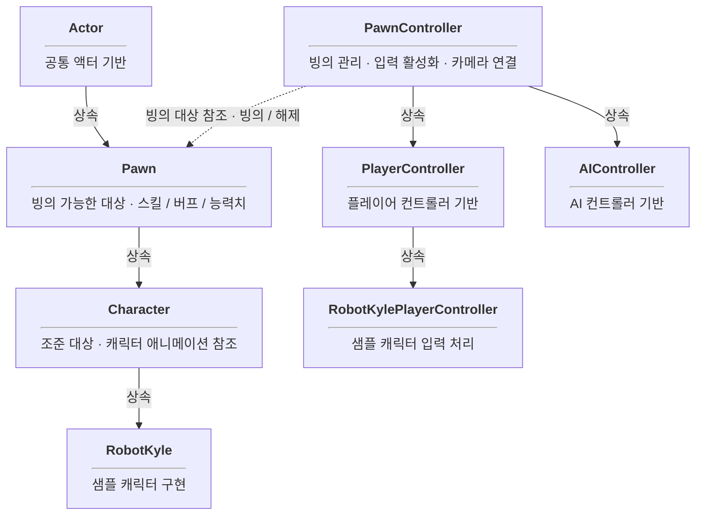

# Unity 샘플 프로젝트

**게임 개발에 필요한 기능을 직접 만들고 쌓아가는 개인용 Unity 샘플 프로젝트**

## 1. 프로젝트 문서

프로젝트 구조, 다이어그램, 개발된 기능과 작성 요령은 아래 다큐먼트에서 확인하실 수 있습니다.

[프로젝트 다큐먼트 보기](https://mdj0126.github.io/SampleProjectForUnity/docs/documentation/index.html)

## 2. 이 프로젝트에서는 무엇을 확인할 수 있나요?

TPS 게임을 구성하는 주요 기능과, 이를 하나의 게임으로 연결하는 개발 구조를 살펴볼 수 있습니다. 개별 기능의 구현을 넘어, 게임 전반의 코드가 어떤 역할로 나뉘고 서로 어떻게 연결되는지 확인할 수 있도록 구성한 샘플 프로젝트입니다.

기존 Unity 개발 경험을 통해 정립한 주요 패턴에 Unreal Engine의 장점을 접목해 개발하고 있습니다.

[프로젝트 다운로드 (ZIP · 약 400MB)](https://github.com/MDJ0126/SampleProjectForUnity/archive/refs/heads/main.zip)

## 3. 캐릭터 · 컨트롤러 상속 및 구성 구조

캐릭터와 컨트롤러의 상속 관계, 캐릭터에 연결된 기능별 구성을 살펴볼 수 있습니다. 상속 관계와 내부 구성을 나누어 표시합니다.

### 캐릭터 · 컨트롤러 상속 관계

`Actor → Pawn → Character → RobotKyle`은 캐릭터의 상속 계층입니다. 컨트롤러는 별도의 `PawnController` 계층에서 파생되며, 캐릭터를 상속하는 대신 `Pawn`에 빙의하여 제어합니다.

### 캐릭터 내부 구성

#### 이동 · 애니메이션

- **Movement**: 이동 · 달리기 · 점프 · 회전\
  [Movement.cs](Assets/Scripts/InGame/Object/Pawn/Movement.cs)
- **CharacterAnimationController**: 이동 상태 반영 · 애니메이션 갱신\
  [CharacterAnimationController.cs](Assets/Scripts/InGame/Object/Pawn/Character/CharacterAnimationController.cs)

#### 스킬 · 버프 · 능력치

- **SkillManager**: 스킬 보유 · 갱신\
  [SkillManager.cs](Assets/Scripts/InGame/Skill/SkillManager.cs)
- **BuffManager**: 지속 효과 · 수명 관리\
  [BuffManager.cs](Assets/Scripts/InGame/Buff/BuffManager.cs)
- **StatusInfo**: 현재 체력 · 기본 능력치\
  [StatusInfo.cs](Assets/Scripts/InGame/Status/StatusInfo.cs)

## 4. 개발된 기능

### 캐릭터 · 플레이어 제어

- **캐릭터 · 빙의**: 컴포넌트 구성, 기본 캐릭터 빙의 및 입력 연결\
  [Character.cs](Assets/Scripts/InGame/Object/Pawn/Character/Character.cs), [PlayerController.cs](Assets/Scripts/InGame/Object/PlayerController.cs)
- **이동**: 카메라 기준 이동, 달리기·점프·회전, 지면·경사 판정\
  [Movement.cs](Assets/Scripts/InGame/Object/Pawn/Movement.cs)
- **애니메이션 · Foot IK**: 이동 상태 반영, 발 위치·몸체 높이 보정\
  [CharacterAnimationController.cs](Assets/Scripts/InGame/Object/Pawn/Character/CharacterAnimationController.cs), [CharacterAnimationController.FootIK.cs](Assets/Scripts/InGame/Object/Pawn/Character/CharacterAnimationController.FootIK.cs)
- **조준 · 카메라**: 화면 중앙 조준, 궤도 회전, 장애물 대응\
  [AimTarget.cs](Assets/Scripts/InGame/Object/Pawn/Character/AimTarget.cs), [PlayerCameraController.cs](Assets/Scripts/Common/PlayerCameraController.cs)
- **스킬 · 버프 · 능력치**: 스킬·지속 효과 관리, 캐릭터 상태 데이터\
  [SkillManager.cs](Assets/Scripts/InGame/Skill/SkillManager.cs), [BuffManager.cs](Assets/Scripts/InGame/Buff/BuffManager.cs), [StatusInfo.cs](Assets/Scripts/InGame/Status/StatusInfo.cs)

### HUD

- **월드 추적**: 월드 좌표를 화면 좌표로 변환해 대상 추적\
  [FollowHUD.cs](Assets/Scripts/UI/HUD/FollowHUD.cs)
- **HUD 관리**: 이름·말풍선·체력바 부착 및 해제, 풀을 통한 재사용\
  [HUDManager.cs](Assets/Scripts/UI/HUD/HUDManager.cs)
- **앵커**: HUD 기준점 설정, 씬 뷰 위치·이름 표시\
  [WidgetAnchor.cs](Assets/Scripts/UI/HUD/WidgetAnchor.cs)

### 유틸리티 · 에디터

- **싱글톤 · 일반 클래스용**: 공용 인스턴스 관리\
  [SingletonBehaviour.cs](Assets/Scripts/Utils/SingletonBehaviour.cs), [Singleton.cs](Assets/Scripts/Utils/Singleton.cs)
- **오브젝트 풀 · 코루틴 캐시**: 오브젝트와 대기 명령 재사용\
  [ObjectPool.cs](Assets/Scripts/Utils/ObjectPool.cs), [YieldInstructionCache.cs](Assets/Scripts/Utils/YieldInstructionCache.cs)
- **공통 도구 · 지면 타일링**: 카메라·레이어·확률·오브젝트 검색, 텍스처 크기 조절\
  [Utils.cs](Assets/Scripts/Utils/Utils.cs), [GroundTiling.cs](Assets/Scripts/Common/GroundTiling.cs)
- **읽기 전용 · 표시 이름**: 인스펙터 속성 표시 보조\
  [ReadOnlyAttribute.cs](Assets/Scripts/Etc/ReadOnlyAttribute.cs), [DisplayNameAttribute.cs](Assets/Scripts/Etc/DisplayNameAttribute.cs)
- **카메라 핸들 · 빙의 단축키**: 씬 뷰 카메라 편집, 캐릭터 제어 테스트\
  [SpringArmEditor.cs](Assets/Scripts/Common/Editor/SpringArmEditor.cs), [EditorPossessInput.cs](Assets/Scripts/Common/EditorPossessInput.cs)

## 5. 프로젝트 환경

- **Unity Editor:** 6000.0.83f1
