# 인게임 다이어그램

시스템 사이의 역할과 연결을 설명합니다. 아래 Player Controller에는 구체 RobotKylePlayerController의 입력·조준 처리를 포함합니다. 구성도는 실행 순서가 아닙니다.

인게임 전체 연결도에는 시스템 사이의 역할과 주요 연결을 표시합니다.

### 인게임 전체 연결

```mermaid
---
config:
  theme: base
  themeVariables:
    background: "#b8c7d9"
    primaryColor: "#edf2f8"
    primaryTextColor: "#1e293b"
    primaryBorderColor: "#94a3b8"
    lineColor: "#64748b"
    secondaryColor: "#d6e0ed"
    tertiaryColor: "#d6e0ed"
    clusterBkg: "#d6e0ed"
    clusterBorder: "#8da2ba"
    titleColor: "#334155"
    edgeLabelBackground: "#d6e0ed"
  themeCSS: |
    a, a:link, a:visited, a:hover, a:active, a:focus, a *,
    .node a, .node a:link, .node a:visited, .node a:hover,
    .node .nodeLabel, .node .nodeLabel *, .node text {
      color: #1e293b !important;
      fill: #1e293b !important;
      text-decoration: none !important;
      text-decoration-line: none !important;
    }
---
flowchart LR
    GameMode[Game Mode] -->|기본 Pawn 빙의 요청| Controller[Player Controller]
    Controller -->|빙의 · 입력 전달| Character[Character / Pawn]
    Controller -->|Spring Arm 연결| Camera["Camera Controller<br/>궤도 회전 · 장애물 대응"]
    Character -->|HUD 부착 · 해제| HUD["HUD Manager<br/>Object Pool · 월드 추적 HUD"]

    classDef default fill:#edf2f8,stroke:#8da2ba,color:#1e293b
    classDef focus fill:#b9d3ef,stroke:#527fae,color:#1e293b,stroke-width:2px
    class Character focus

    click GameMode href "https://github.com/MDJ0126/SampleProjectForUnity/blob/main/Assets/Scripts/Management/GameMode.cs" "GameMode.cs 열기" _blank
    click Controller href "https://github.com/MDJ0126/SampleProjectForUnity/blob/main/Assets/Scripts/InGame/Object/PlayerController.cs" "PlayerController.cs 열기" _blank
    click Character href "https://github.com/MDJ0126/SampleProjectForUnity/blob/main/Assets/Scripts/InGame/Object/Pawn/Character/Character.cs" "Character.cs 열기" _blank
    click Camera href "https://github.com/MDJ0126/SampleProjectForUnity/blob/main/Assets/Scripts/Common/PlayerCameraController.cs" "PlayerCameraController.cs 열기" _blank
    click HUD href "https://github.com/MDJ0126/SampleProjectForUnity/blob/main/Assets/Scripts/UI/HUD/HUDManager.cs" "HUDManager.cs 열기" _blank
```

`GameMode`가 기본 `Pawn`의 빙의를 요청하면 `PlayerController`가 이동 입력, 조준 대상과 카메라를 연결합니다. 카메라는 캐릭터 하위의 `SpringArm`을 기준으로 움직이며, HUD는 `WidgetAnchor`를 추적하고 오브젝트 풀을 통해 재사용됩니다.

현재 HUD 앵커는 PawnInfoAnchor와 balloonAnchor입니다. 이름·체력 데이터는 별도 SetPawn 연결이 필요합니다. 실제 실행은 미확인입니다.

캐릭터 상세 구성은 [캐릭터 다이어그램](22-character-diagrams.md)을 참고합니다.
