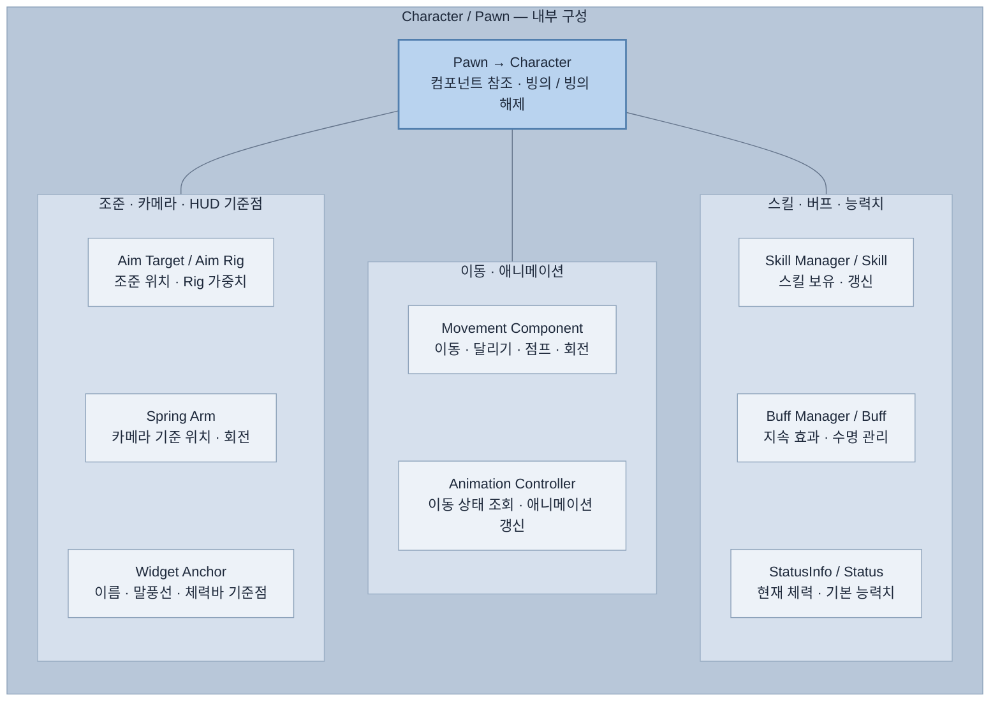

# 캐릭터 다이어그램

## 캐릭터 내부 구성

`Pawn`을 상속하는 `Character`를 기준으로 묶었습니다. 아래 박스의 배치는 실행 순서가 아니라 기능별 구성 목록입니다.

현재 HUD 앵커는 PawnInfoAnchor와 balloonAnchor입니다. 이름·체력 데이터는 별도 SetPawn 연결이 필요합니다. 실제 실행은 미확인입니다.

[인게임 전체 연결](07-diagrams.md)을 참고합니다.
